# Mermaid Diagrams - Boas Práticas

Esta skill fornece diretrizes e boas práticas para criar diagramas profissionais e legíveis usando Mermaid.

## Quando Usar

- Criar fluxogramas de processos
- Documentar arquitetura de sistemas
- Visualizar fluxos de dados
- Criar diagramas de sequência para APIs
- Modelar entidades e relacionamentos (ERD)
- Criar diagramas de estado
- Visualizar cronogramas (Gantt)
- Criar mindmaps e diagramas de classe

## Tipos de Diagramas Disponíveis

### 1. Flowchart (Fluxograma)

**Quando usar:** Processos, decisões, fluxos de trabalho

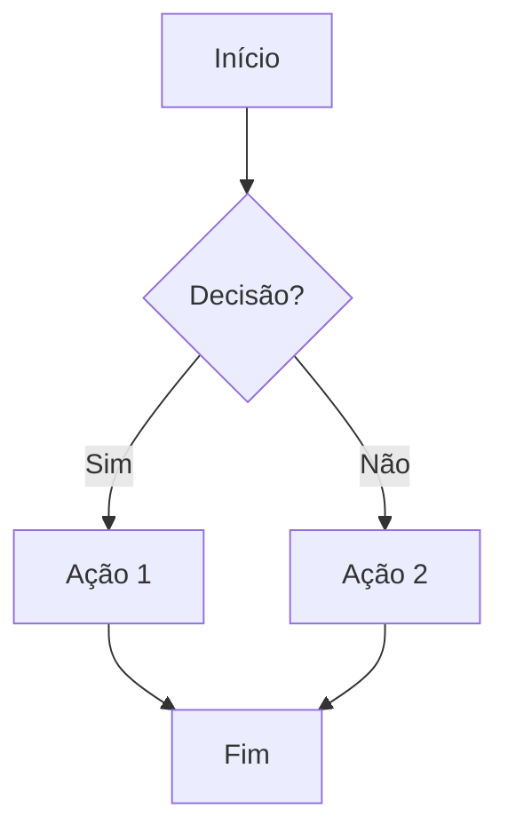

**Direções:**
- `TD` ou `TB`: Top to Down (cima para baixo)
- `BT`: Bottom to Top (baixo para cima)
- `LR`: Left to Right (esquerda para direita)
- `RL`: Right to Left (direita para esquerda)

**Formas de nós:**
- `[texto]` - Retângulo
- `(texto)` - Retângulo arredondado
- `{texto}` - Losango (decisão)
- `([texto])` - Estádio/Pill
- `[[texto]]` - Subrotina
- `[(texto)]` - Cilindro (database)
- `((texto))` - Círculo
- `>texto]` - Flag
- `{{texto}}` - Hexágono

### 2. Sequence Diagram (Diagrama de Sequência)

**Quando usar:** Interações entre sistemas, APIs, comunicação

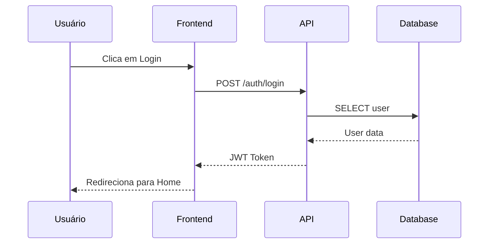

**Tipos de setas:**
- `->` : Linha sólida sem seta
- `-->` : Linha pontilhada sem seta
- `->>` : Linha sólida com seta
- `-->>` : Linha pontilhada com seta
- `-x` : Linha sólida com X (erro/falha)
- `--x` : Linha pontilhada com X

### 3. Entity Relationship Diagram (ERD)

**Quando usar:** Modelagem de banco de dados, relacionamentos

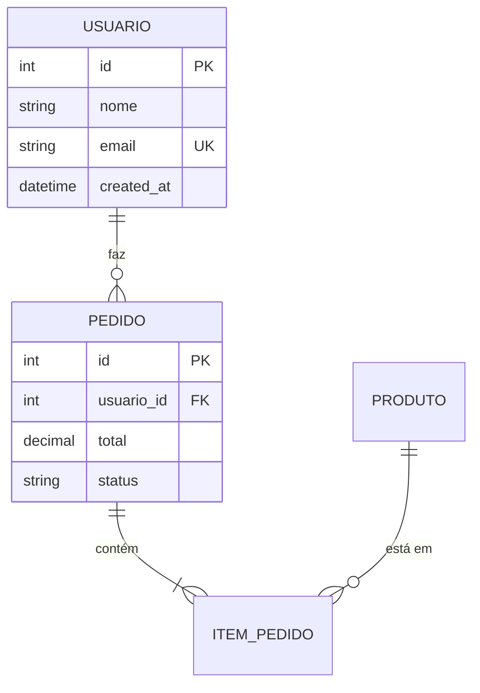

**Cardinalidades:**
- `||--||` : Um para um
- `||--o{` : Um para muitos (opcional)
- `||--|{` : Um para muitos (obrigatório)
- `o{--o{` : Muitos para muitos

### 4. State Diagram (Diagrama de Estado)

**Quando usar:** Máquinas de estado, ciclo de vida de objetos

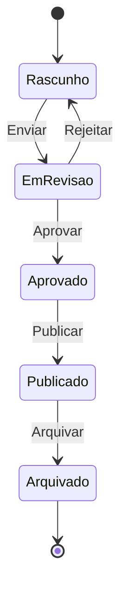

### 5. Class Diagram (Diagrama de Classe)

**Quando usar:** Estrutura de classes, OOP, arquitetura

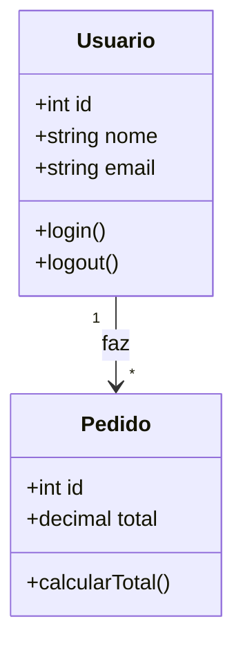

**Visibilidade:**
- `+` : Público
- `-` : Privado
- `#` : Protegido
- `~` : Package

### 6. Gantt Chart

**Quando usar:** Cronogramas, planejamento de projeto

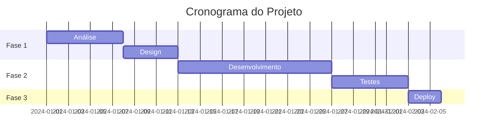

### 7. Mindmap

**Quando usar:** Brainstorming, organização de ideias

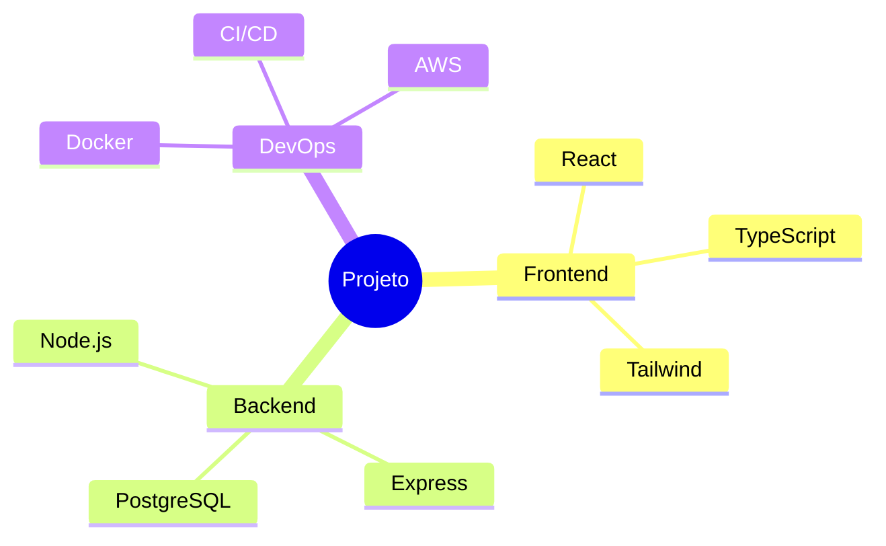

### 8. Pie Chart

**Quando usar:** Distribuição, proporções

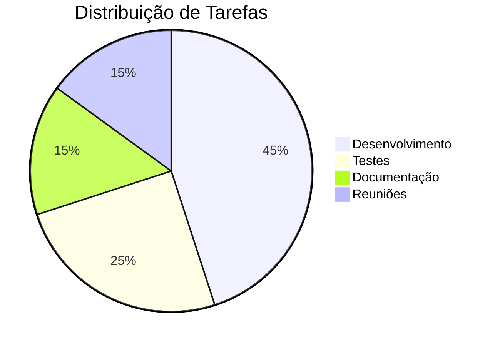

## Boas Práticas Gerais

### 1. Clareza e Simplicidade
- **Limite nós por diagrama:** Máximo 15-20 nós para manter legibilidade
- **Use labels descritivos:** Nomes claros e concisos
- **Evite cruzamento de linhas:** Reorganize para minimizar cruzamentos

### 2. Hierarquia Visual
- **Fluxo consistente:** Mantenha direção consistente (geralmente TD ou LR)
- **Agrupe elementos relacionados:** Use subgraphs para organizar
- **Destaque caminhos principais:** Use estilos diferentes para fluxos críticos

### 3. Nomenclatura
- **IDs curtos:** Use IDs de 1-3 caracteres (A, B, C ou A1, A2)
- **Labels descritivos:** O texto visível deve ser autoexplicativo
- **Consistência:** Mantenha padrão de nomenclatura

### 4. Uso de Subgraphs (Agrupamento)

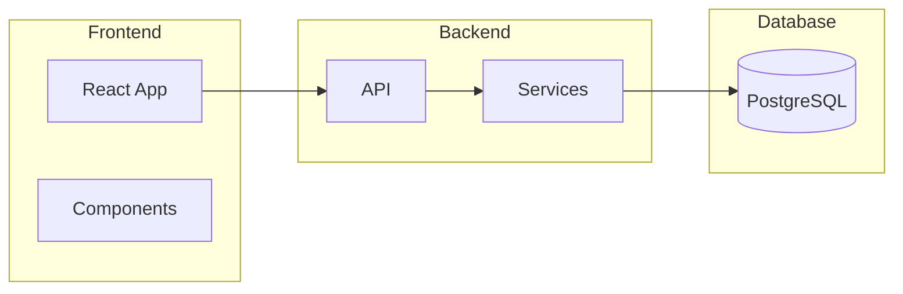

### 5. Estilização

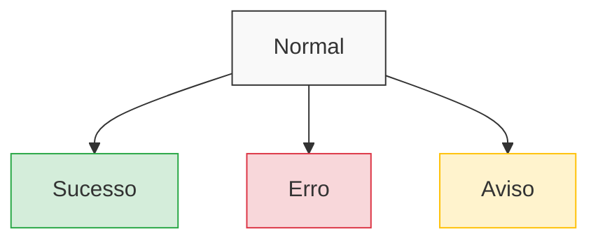

### 6. Notas e Comentários

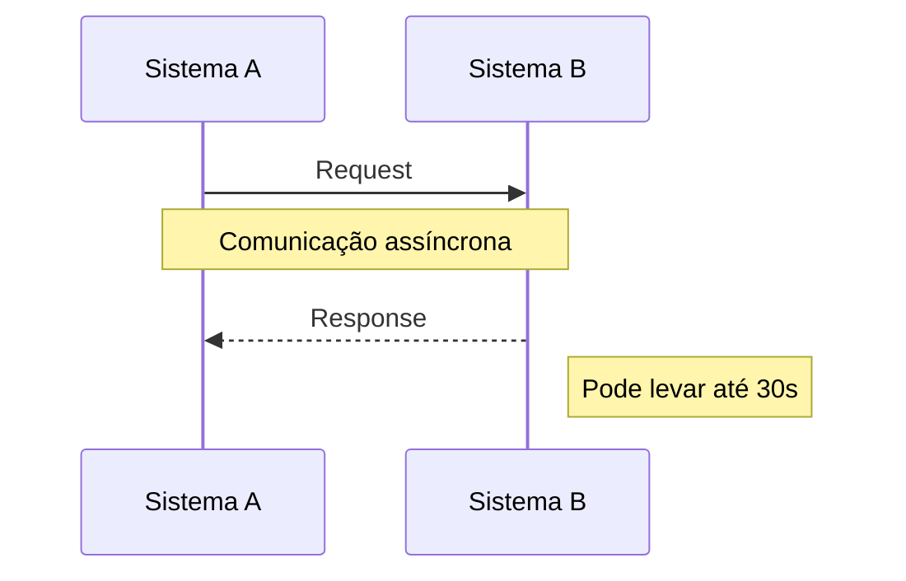

## Anti-Patterns (O que Evitar)

1. **Diagramas muito grandes:** Divida em múltiplos diagramas menores
2. **Labels genéricos:** Evite "Processo 1", "Etapa A" - seja específico
3. **Muitas cores:** Use cores com propósito, não decoração
4. **Setas em todas direções:** Mantenha fluxo previsível
5. **Texto longo em nós:** Use notas ou legendas para detalhes

## Checklist de Qualidade

Antes de finalizar um diagrama, verifique:

- [ ] O propósito do diagrama está claro?
- [ ] Todos os nós têm labels descritivos?
- [ ] O fluxo é fácil de seguir?
- [ ] Não há mais de 15-20 elementos?
- [ ] As cores têm significado consistente?
- [ ] Elementos relacionados estão agrupados?
- [ ] O diagrama funciona em preto e branco?

## Templates Prontos

### Template: API Flow

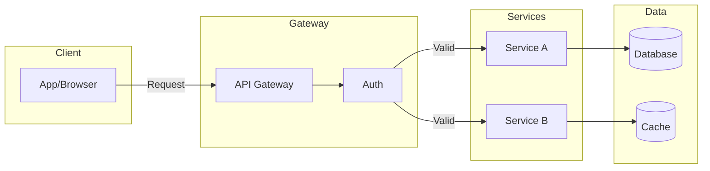

### Template: Error Handling Flow

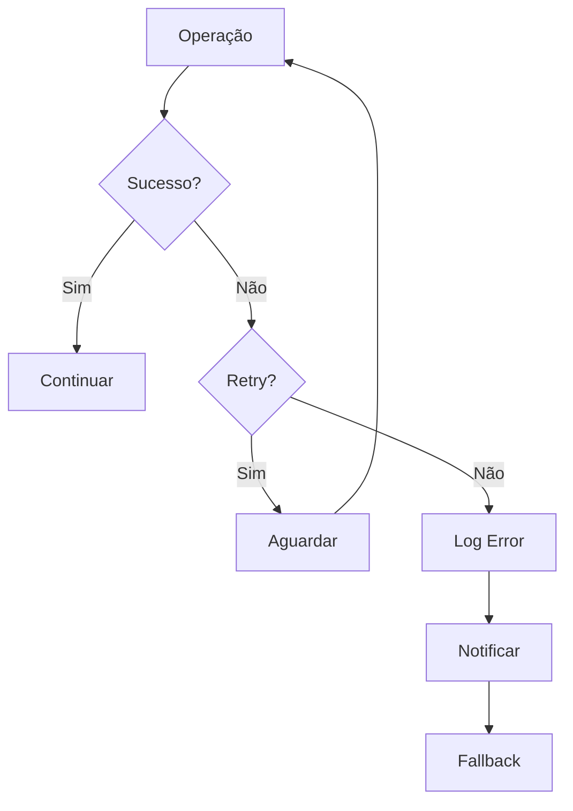

### Template: Authentication Flow

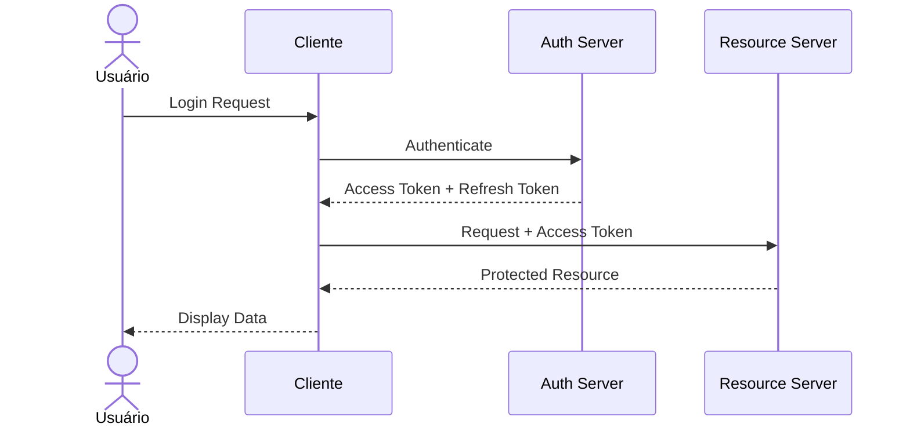

## Dicas Finais

1. **Comece simples:** Adicione complexidade gradualmente
2. **Teste renderização:** Verifique se o diagrama renderiza corretamente
3. **Peça feedback:** Diagramas devem ser compreensíveis por outros
4. **Versione:** Mantenha diagramas junto ao código relacionado
5. **Atualize:** Diagramas desatualizados são piores que nenhum diagrama
