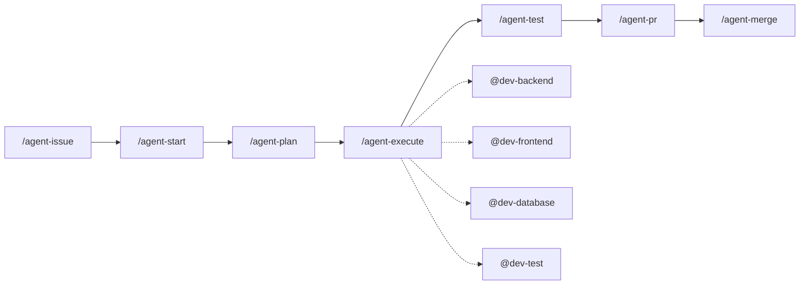

# Hyper MultiAgents

Sistema multiagente para desenvolvimento de software assistido por IA no Cursor IDE.

## Visão Geral

Este sistema implementa um workflow completo de desenvolvimento usando agentes especializados que trabalham em conjunto para transformar ideias em código pronto para produção.



## Instalação

1. Clone este repositório ou copie a pasta `.cursor/` para seu projeto
2. Reinicie o Cursor IDE
3. Os commands estarão disponíveis ao digitar `/` no chat

## Agentes Principais (Commands)

Use estes commands no chat do Cursor digitando `/`:

| Command | Descrição |
|---------|-----------|
| `/agent-issue` | Cria uma issue bem estruturada no GitHub |
| `/agent-start` | Inicia desenvolvimento: cria branch e documenta contexto |
| `/agent-plan` | Cria plano de execução com checklist detalhado |
| `/agent-execute` | Executa o plano, delegando para sub-agentes |
| `/agent-test` | Roda testes e corrige falhas automaticamente |
| `/agent-pr` | Gera relatório e cria Pull Request |
| `/agent-merge` | Executa merge, resolve conflitos quando possível |

### Workflow Completo

```bash
# 1. Criar issue a partir de uma ideia
/agent-issue Implementar autenticação com Google OAuth

# 2. Iniciar desenvolvimento da issue
/agent-start #123

# 3. Criar plano de execução
/agent-plan #123

# 4. Executar o plano
/agent-execute #123

# 5. Rodar e corrigir testes
/agent-test #123

# 6. Criar PR
/agent-pr #123

# 7. Fazer merge
/agent-merge #123
```

## Sub-agentes Especializados

Sub-agentes são invocados automaticamente pelo `/agent-execute`:

| Sub-agente | Especialidade |
|------------|---------------|
| `@dev-backend` | APIs, serviços, lógica de negócio |
| `@dev-frontend` | Componentes UI, estilos, interações |
| `@dev-database` | Schemas, migrations, queries |
| `@dev-test` | Testes unitários e de integração |
| `@dev-docs` | Documentação e comentários |

### Invocação Manual

Você também pode invocar sub-agentes diretamente:

```
/dev-backend Criar endpoint de autenticação
/dev-frontend Criar componente de login
```

## Hooks Automáticos

O sistema inclui hooks que rodam automaticamente:

| Hook | Trigger | Função |
|------|---------|--------|
| `verify-documentation` | Após edição de arquivo | Verifica documentação (Google Style) |
| `check-formatting` | Após edição de arquivo | Verifica formatação do código |
| `execution-summary` | Fim de execução | Gera resumo da sessão |
| `audit-commands` | Antes de comando shell | Audita e bloqueia comandos perigosos |

### Logs

Os hooks geram logs em `.cursor/hooks/logs/`:

- `documentation.log` - Issues de documentação encontradas
- `formatting.log` - Issues de formatação encontradas
- `commands.log` - Histórico de comandos executados
- `sessions.log` - Resumo das sessões

## Estrutura de Pastas

```
.cursor/
├── commands/           # Agentes principais
│   ├── agent-issue.md
│   ├── agent-start.md
│   ├── agent-plan.md
│   ├── agent-execute.md
│   ├── agent-test.md
│   ├── agent-pr.md
│   └── agent-merge.md
├── agents/             # Sub-agentes especializados
│   ├── dev-backend.md
│   ├── dev-frontend.md
│   ├── dev-database.md
│   ├── dev-test.md
│   └── dev-docs.md
├── hooks/              # Scripts de hooks
│   ├── verify-documentation.js
│   ├── check-formatting.js
│   ├── execution-summary.js
│   ├── audit-commands.js
│   └── logs/           # Logs gerados
└── hooks.json          # Configuração dos hooks

.issues/                # Criado pelo agent-start
└── {numero}/
    ├── CONTEXT.md      # Contexto da issue
    ├── ARCHITECTURE.md # Decisões de arquitetura
    ├── PLAN.md         # Checklist de execução
    └── NOTES.md        # Notas adicionais
```

## Padrões de Código

O sistema segue o **Google Style Guide** para:

- Documentação (JSDoc/TSDoc/docstrings)
- Formatação (indentação, comprimento de linha)
- Nomenclatura
- Estrutura de código

## Personalização

### Adicionar Novo Sub-agente

Crie um arquivo `.cursor/agents/seu-agente.md`:

```markdown
---
name: seu-agente
description: Descrição do que o agente faz. Use quando...
model: inherit
---

# Instruções do Agente

Você é um especialista em...
```

### Adicionar Novo Hook

1. Crie o script em `.cursor/hooks/seu-hook.js`
2. Adicione a configuração em `.cursor/hooks.json`

```json
{
  "hooks": {
    "afterFileEdit": [
      { "command": "node .cursor/hooks/seu-hook.js" }
    ]
  }
}
```

### Adicionar Novo Command

Crie um arquivo `.cursor/commands/seu-command.md`:

```markdown
# Título do Command

## Objetivo
O que este command faz.

## Instruções
Passo a passo para o agente seguir.
```

## Requisitos

- Cursor IDE
- Node.js (para hooks)
- GitHub CLI (`gh`) - para operações com GitHub

## Contribuindo

1. Fork o repositório
2. Crie uma branch: `git checkout -b feature/nova-funcionalidade`
3. Faça commit: `git commit -m 'feat: adiciona nova funcionalidade'`
4. Push: `git push origin feature/nova-funcionalidade`
5. Abra um Pull Request

## Licença

MIT
