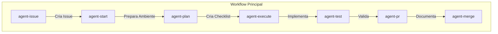
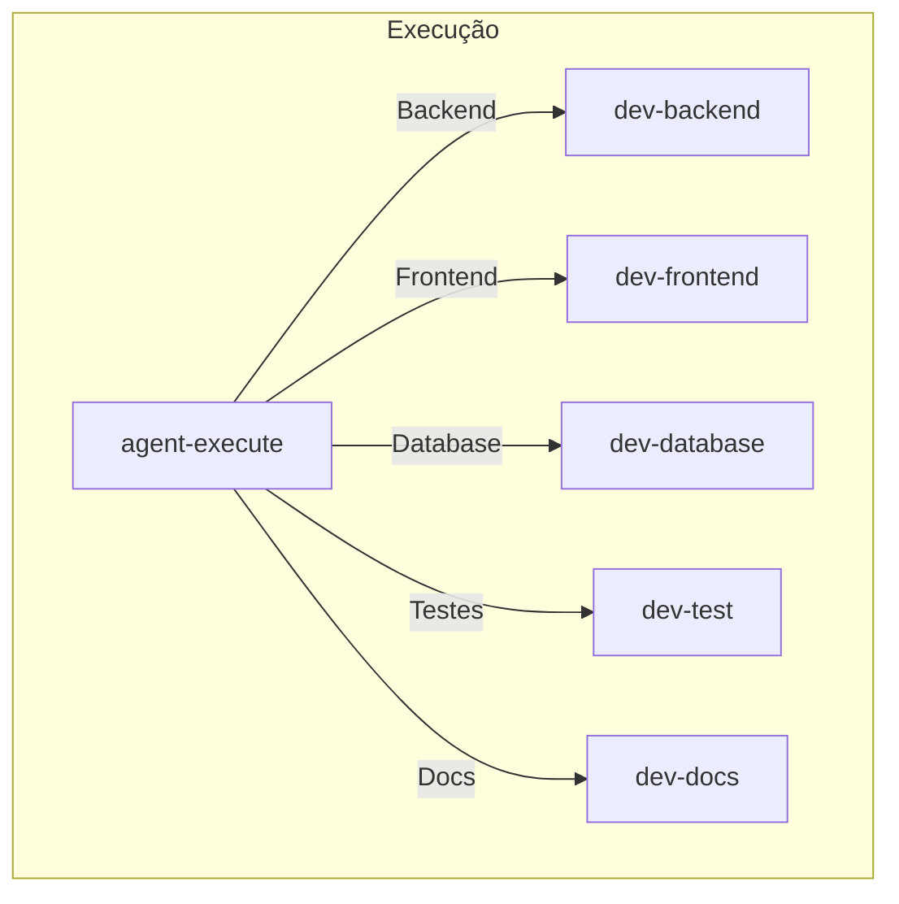
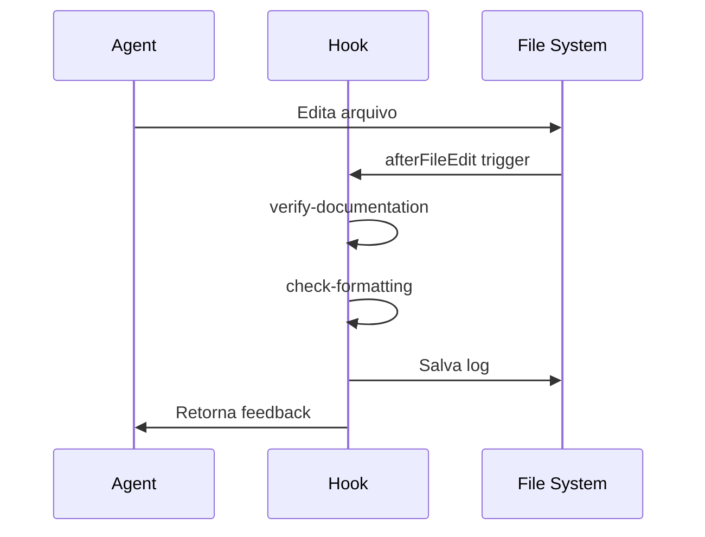

# Arquitetura do Sistema

## Visão Geral

O Hyper MultiAgents é um sistema de orquestração de agentes de IA para desenvolvimento de software, projetado para funcionar dentro do Cursor IDE.

## Componentes

### 1. Commands (Agentes Principais)

Os commands são os agentes de alto nível que orquestram o workflow de desenvolvimento.



**Características:**
- Definidos como arquivos Markdown em `.cursor/commands/`
- Invocados via `/nome-do-command` no chat
- Contêm instruções detalhadas para o modelo de IA

### 2. Sub-agentes (Especialistas)

Os sub-agentes são especialistas em domínios específicos, invocados pelo `agent-execute`.



**Características:**
- Definidos como arquivos Markdown em `.cursor/agents/`
- Contêm frontmatter YAML com configurações
- Podem ser invocados via ferramenta Task ou diretamente

### 3. Hooks (Automação)

Os hooks são scripts que rodam automaticamente em pontos específicos do ciclo de vida do agente.



**Características:**
- Scripts JavaScript em `.cursor/hooks/`
- Configurados em `.cursor/hooks.json`
- Podem bloquear, modificar ou apenas observar ações

## Fluxo de Dados

### Documentação de Issue

```
.issues/{numero}/
├── CONTEXT.md      ← agent-start cria
├── ARCHITECTURE.md ← agent-start cria
├── PLAN.md         ← agent-plan cria
└── NOTES.md        ← agent-execute atualiza
```

### Logs de Hooks

```
.cursor/hooks/logs/
├── documentation.log ← verify-documentation
├── formatting.log    ← check-formatting
├── commands.log      ← audit-commands
└── sessions.log      ← execution-summary
```

## Padrões de Design

### 1. Separação de Responsabilidades

Cada agente tem uma responsabilidade única e bem definida:
- `agent-issue`: Criação de issues
- `agent-start`: Preparação de ambiente
- `agent-plan`: Planejamento
- `agent-execute`: Implementação
- `agent-test`: Validação
- `agent-pr`: Documentação de mudanças
- `agent-merge`: Integração

### 2. Delegação

O `agent-execute` delega tarefas especializadas para sub-agentes apropriados, baseado em tags no plano (`@dev-backend`, `@dev-frontend`, etc.).

### 3. Observabilidade

Hooks de auditoria e logging garantem rastreabilidade de todas as ações:
- Comandos executados
- Arquivos modificados
- Issues de qualidade encontradas

### 4. Fail-Safe

Hooks de segurança bloqueiam comandos potencialmente perigosos e solicitam confirmação para ações sensíveis.

## Extensibilidade

### Adicionando Novos Agentes

1. **Command**: Criar arquivo em `.cursor/commands/` seguindo o template
2. **Sub-agente**: Criar arquivo em `.cursor/agents/` com frontmatter YAML

### Adicionando Novos Hooks

1. Criar script em `.cursor/hooks/`
2. Registrar em `.cursor/hooks.json`
3. Implementar leitura de stdin JSON e saída de stdout JSON

## Considerações de Segurança

1. **Auditoria**: Todos os comandos são logados
2. **Bloqueio**: Comandos destrutivos são bloqueados
3. **Confirmação**: Operações sensíveis requerem aprovação
4. **Isolamento**: Sub-agentes rodam em contexto próprio

## Limitações Conhecidas

1. Hooks dependem de Node.js estar disponível
2. Integração com GitHub requer CLI `gh` configurada
3. Sub-agentes não podem invocar outros sub-agentes (limitação do Cursor)
